真实世界的全栈工程师
===

> 30分钟了解《Growth：Web开发思想》

在《Growth：Web开发思想》出版以前，请参考开源电子书《[Growth：全栈增长工程师实战](https://github.com/phodal/growth-in-action)》与《[Growth: 全栈增长工程师指南](https://github.com/phodal/growth-ebook)》。

引言：精益与全栈
---

在埃里克·莱斯的《精益创业》中提到了下面的精益环路：

而精益的思想是**在生产过程中减少的浪费**，在软件开发的过程中最容易造成浪费的就是：

 1. 业务人员对于市场的理解不一致，导致做不出用户所需要的产品。这部分可以通过精益环路来提高。
 2. 开发人员对于需求的了解不清晰，导致结果与业务人员所需要的不一致。这部分则可以通过改善流程来解决。
 3. 开发人员与第三方开发商的沟通问题。呵呵。
 4. 团队内部的沟通与集成问题

当我们讨论全栈的时候，我们就是想解决沟通带来的时间浪费问题。沟通不畅最好的例子就是**巴别塔**：

而前后端分离带来的第一个痛点就是：集成。如果你和我们一样采用敏捷开发流程的话，你就可以很容易看到这个问题了：

当你已经完成前端功能的时候，后端还没完成。你可能就需要开发额外的业务卡，最后等后端完成时再回来集成。尽管我们会在实践上使用基于契约的开发模式：

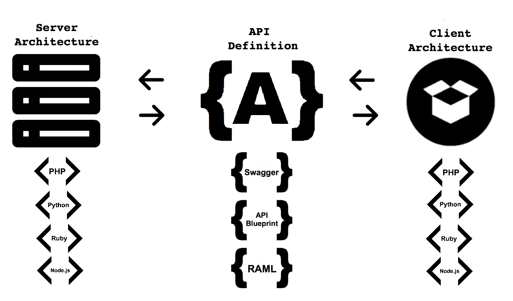

但是一旦我们发现最初的契约不符合我们要求的时候，我们就需要重新修改前后端。这时对接这个 API 的人，就需要放下手头的工作来更新这个 API。

尽管你们已经采用了迭代式开发，但是前后端分离在一夜又将软件开发放到了解放前的瀑布流：

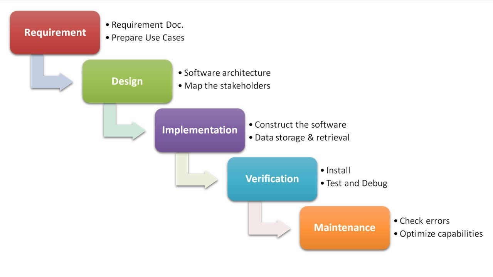

在我最初的项目里，我们采用全功能团队的模式，主要是因为团队小——小的团队一遇到一两个人请假，就可能会出现风险。尽管后来我们的团队从6个人变成了12个人，我们仍然采用这种模式。我们采用结对编程是一个方面，另外一个方面是：团队里就需要有一个人来专门解决各种大小事务。如持续集成有问题、自动构建出错、测试有问题等等，没有人愿意专门去做这样的事。

本文总结了正在撰写的《Growth：Web开发思想》里提出的一系列实践，为18个步骤:

 - Tasking，即将目标切换成一个个小的任务，而这些任务尽可能的遵循 SMART 原则，如这里的 18 个步骤。
 - Setup，搭建开发所需要的基本环境，并尽最大能力地去练习 IDE 及操作系统等等日常工具的使用。
 - UI Prototype，可以使用简单的使用 UI 工具来创建 Web 页面的原型。
 - Technology Decision，能根据我们的能力以及项目的需要，选择合适的工具。
 - hello, world -> Boilerplate，能自己搭建或者寻求一些比较好的 应用模板。
 - Build Pipeline，可以设计出整个应用的构建流程，如依赖包管理、运行服务、执行语法检测、运行测试等等。
 - Coding，至少能使用两门以上的语言，一门是 JavaScript，一门是编译语言。光只有动态语言，无法让你理解计算机语言的。
 - Testing，可以编写单元测试、服务测试、UI自动化测试。
 - Deploy，可以完整将应用部署到服务器上。
 - Auto Deploy，要会在本地敲个命令，自动部署新版本的应用到服务器上。
 - Analytics，不仅仅要知道很多用户喜欢这个功能，还要知道为什么。
 - Optimization，即要知道程序中哪里用得多，又要能对代码进行优化。
 - Continuous Intergration，除了学会使用持续集成工具，你还要学习什么是持续集成。
 - Continuous Delivery，就是缺少一个在持续集成与自动化部署之间的按钮。
 - Continuous Deployment，将持续交付的按钮变成自动化就完了？你要改变的不是代码本身 ，还有组织架构。
 - Retro，由输出结果来改入输入流程，这才能提高组织和自身的水平。
 - Refactor，你所以只有代码和架构可以重构么？

任务切分
---

环境搭建
---

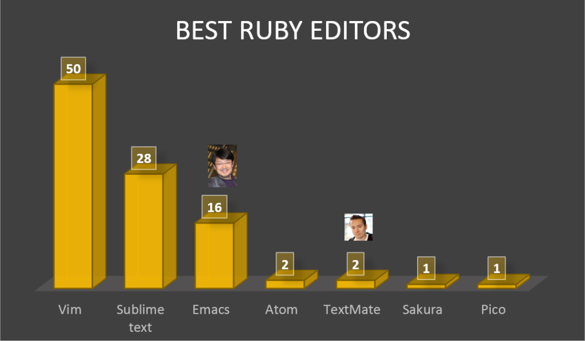

 - IDE / Editor
 - Package Management
 - Quick Launch
 - Command Line
 - Git 

UI原型
---

 - Design Prototype
 - HTML + CSS
 - GitHub Pages

技术选型
---

 - Backend Framework
 - Frontend Framework

hello, world
---

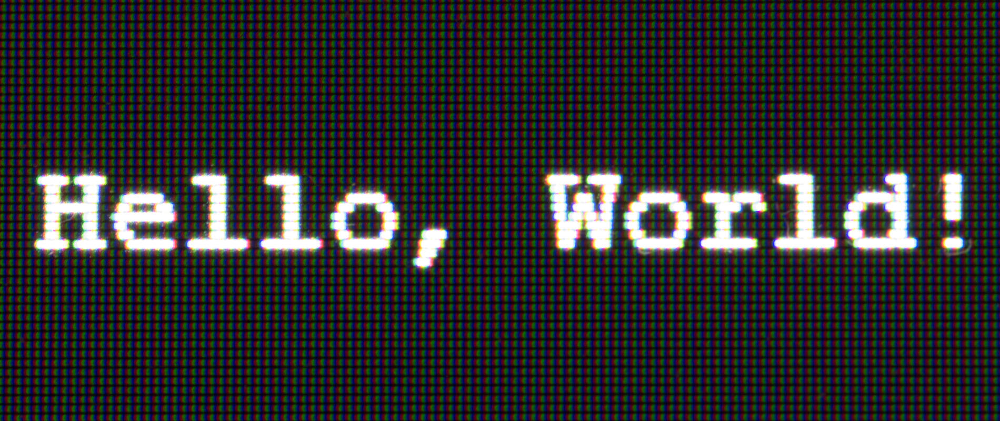

 - Boilerplate with Backend
 - Boilerplate with Frontend

构建流
---

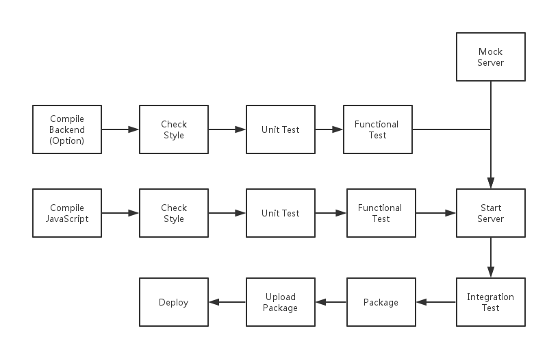

 - Build Tools
 - Build Process

编码
---

 - Merge Prototype
 - MVC
 
测试
---

 - Test Primrad

部署
---

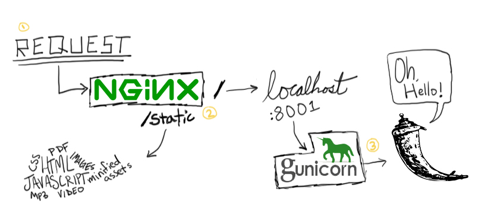

 - HTTP Server
 - WSGI / CGI Server

自动部署
---

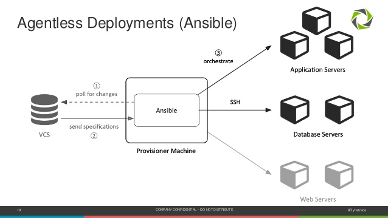
 
  - AutoDeploy Tool
 
分析
---

 - Google Analytics / Piwik

优化
---

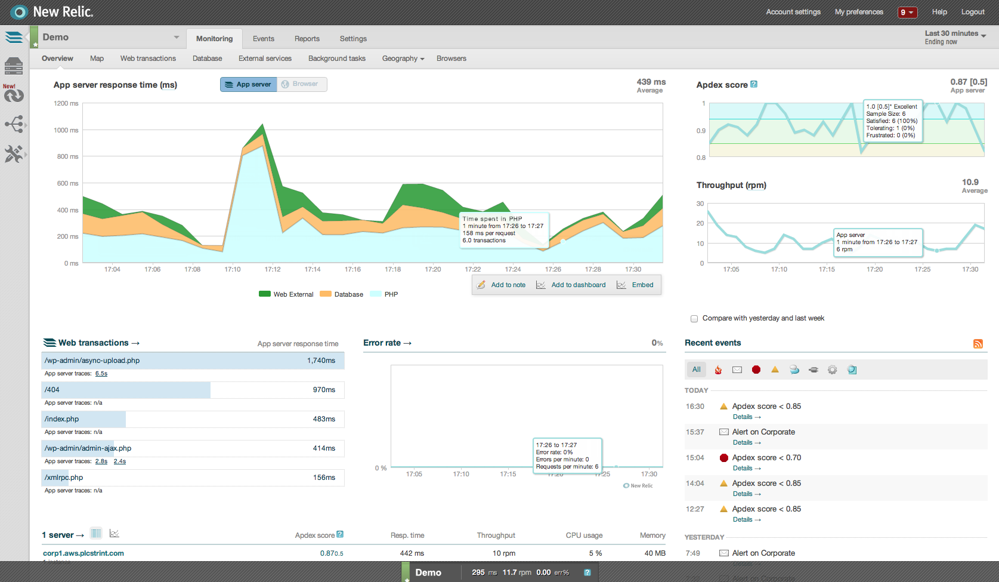

 - Performance Analytics

持续集成
---

 - Continuous Tools : Jenkins

持续交付
---

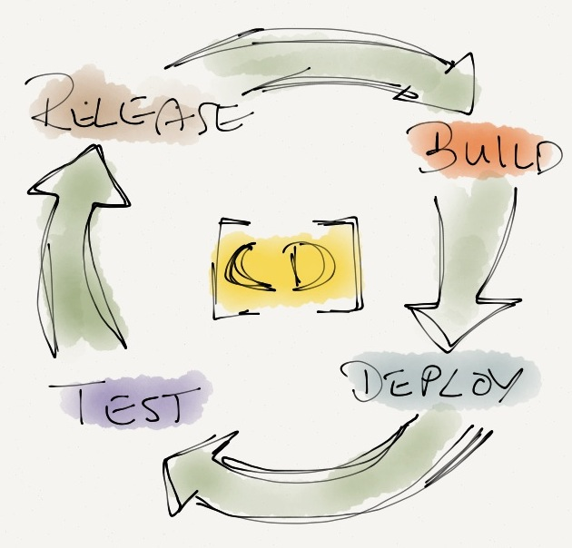

 - Auto Package

持续部署
---

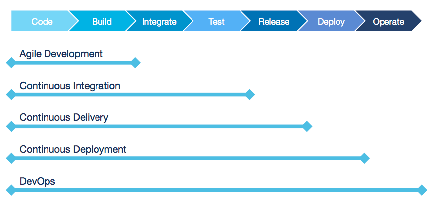

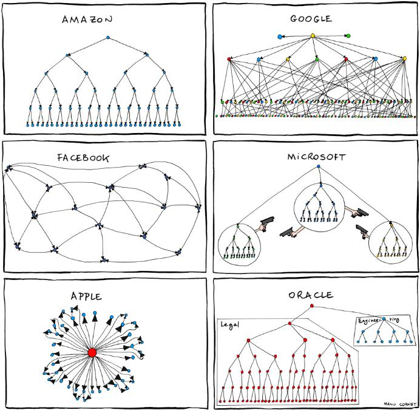

 - DevOps
 - Conway's Lay

SEO
---

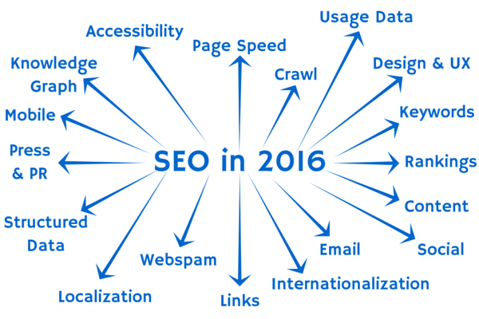

 - Why
 
Retro 
---

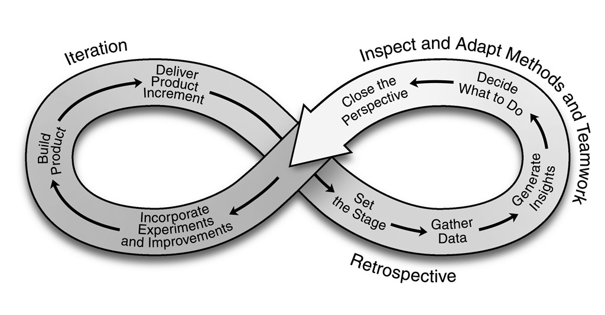

 - Make it Right, Make it Better

Refactor
---

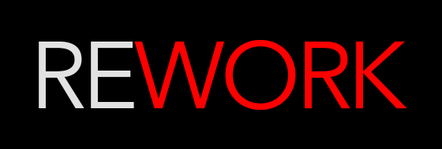
 
