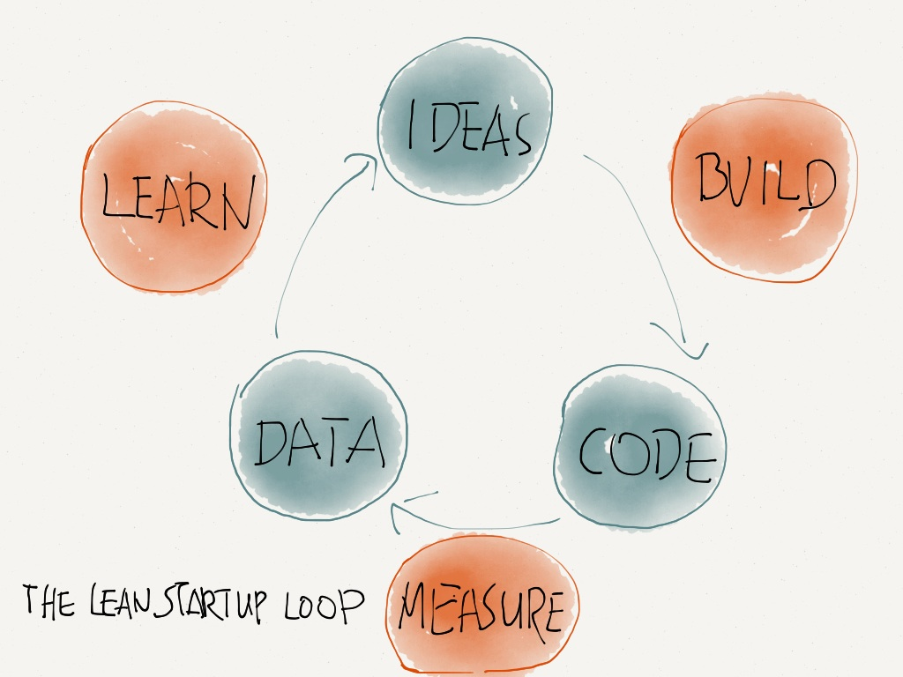
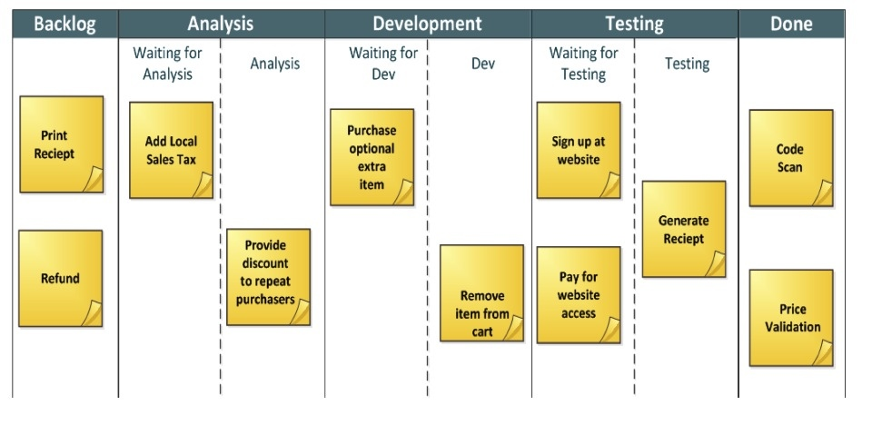

真实世界的全栈工程师
===

> 30分钟了解《Growth：Web开发思想》

在《Growth：Web开发思想》出版以前，请参考开源电子书《[Growth：全栈增长工程师实战](https://github.com/phodal/growth-in-action)》与《[Growth: 全栈增长工程师指南](https://github.com/phodal/growth-ebook)》。

引言：精益与全栈
---

在埃里克·莱斯的《精益创业》中提到了下面的精益环路：

而精益的思想是**在生产过程中减少的浪费**，在软件开发的过程中最容易造成浪费的就是：

 1. 业务人员对于市场的理解不一致，导致做不出用户所需要的产品。这部分可以通过精益环路来提高。
 2. 开发人员对于需求的了解不清晰，导致结果与业务人员所需要的不一致。这部分则可以通过改善流程来解决。
 3. 开发人员与第三方开发商的沟通问题。呵呵。
 4. 团队内部的沟通与集成问题

当我们讨论全栈的时候，我们就是想解决沟通带来的时间浪费问题。沟通不畅最好的例子就是**巴别塔**：

而前后端分离带来的第一个痛点就是：集成。如果你和我们一样采用敏捷开发流程的话，你就可以很容易看到这个问题了：

当你已经完成前端功能的时候，后端还没完成。你可能就需要开发额外的业务卡，最后等后端完成时再回来集成。尽管我们会在实践上使用基于契约的开发模式：

但是一旦我们发现最初的契约不符合我们要求的时候，我们就需要重新修改前后端。这时对接这个 API 的人，就需要放下手头的工作来更新这个 API。

尽管你们已经采用了迭代式开发，但是前后端分离在一夜又将软件开发放到了解放前的瀑布流：

在我最初的项目里，我们采用全功能团队的模式，主要是因为团队小——小的团队一遇到一两个人请假，就可能会出现风险。尽管后来我们的团队从6个人变成了12个人，我们仍然采用这种模式。我们采用结对编程是一个方面，另外一个方面是：团队里就需要有一个人来专门解决各种大小事务。如持续集成有问题、自动构建出错、测试有问题等等，没有人愿意专门去做这样的事。

Steps:

 - Tasking
 - Setup
 - UI Prototype
 - hello, world -> Boilerplate
 - Technology Decision
 - Build Pipeline
 - Coding
 - Testing
 - Deploy
 - Auto Deploy
 - Analytics
 - Performance
 - Continuous Intergration
 - Continuous Delivery
 - Continuous Deployment
 - Retro 
 - Refactor

Tasking
---

Setup
---

 - IDE / Editor
 - Package Management
 - Quick Launch
 - Command Line
 - Git 

UI Prototype
---

 - Design Prototype
 - HTML + CSS
 - GitHub Pages

Technology Decision
---

 - Backend Framework
 - Frontend Framework

hello, world -> Boilerplate
---

 - Boilerplate with Backend
 - Boilerplate with Frontend

Build Pipeline
---

 - Build Tools
 - Build Process

Coding
---

 - Merge Prototype
 - MVC
 
Testing
---

 - Test Primrad

Deploy
---

 - HTTP Server
 - WSGI / CGI Server

Auto Deploy
---
 
  - AutoDeploy Tool
 
Analytics
---

 - Google Analytics / Piwik

APM
---

 - Performance Analytics

Continuous Intergration
---

 - Continuous Tools : Jenkins

Continuous Delivery
---

 - Auto Package

Continuous Deployment
---

 - DevOps
 - Conway's Lay

SEO
---

 - Why
 
Retro 
---

 - Make it Right, Make it Better

Refactor
---

 - TDD
 
